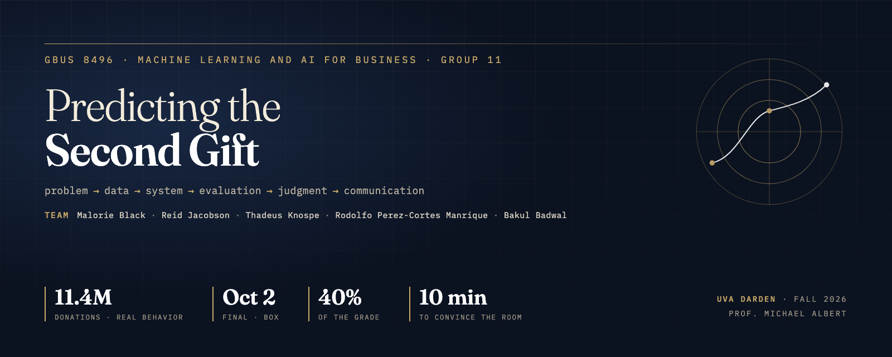

<div align="center">



# GBUS 8496 · Final Group Project

**Machine Learning and AI for Business · Prof. Michael Albert · UVA Darden · Q1 2026–27**

Problem → data → system → evaluation → judgment → communication.
One business problem, one artifact we built, one evaluation we can defend.

</div>

---

## Two deadlines

| | Due | Where | Counts |
|---|---|---|---|
| **Proposal** | **Tue Sep 8, 2026 · midnight** | Canvas → *Final Project Proposal - per team* (one uploader for the team) | Not graded; **approval is mandatory** |
| **Final project** | **Fri Oct 2, 2026 · 11:59 PM** | Box link on Canvas, one file `Group_#.zip` | **40% of the course grade** |

Albert returns proposal feedback **Thu Sep 10**. Presentations are 10 minutes in Sessions 13–14, order drawn at random, all members present.

## Where we are

| Step | Status |
|---|---|
| Team formed (Canvas / Google sheet) | ✅ done |
| Team chat (Teams) | ✅ open |
| Everyone on this repo | ⏳ handles being collected |
| Direction chosen | ⏳ **decide by Sat Sep 5** — see [docs/Project_DIRECTION-MEMO.md](docs/Project_DIRECTION-MEMO.md) |
| Proposal drafted → uploaded | ⏳ draft Sun Sep 6, upload **Mon Sep 7** evening |
| Evaluation harness + gold set | not started (build this **before** the system) |
| System, baselines, error analysis, cost model | not started |
| Slides, exec summary, AI-use note, zip | not started |

## Read these first

1. [docs/Final_Project_SPEC.md](docs/Final_Project_SPEC.md) — Albert's assignment decoded: the five proposal elements, the two hard requirements, the grading formula, the six deliverables, the nine worked examples, a week-by-week timeline, and a five-person workstream split.
2. [docs/Project_DIRECTION-MEMO.md](docs/Project_DIRECTION-MEMO.md) — five candidate directions scored against the rubric, with a recommendation (a contract-diligence assistant on CUAD with a "which clauses still need a lawyer" triage layer) and a fallback (hotel overbooking policy). **Not yet decided — that is the team's call this week.**
3. [docs/albert/Final_Group_Project_Albert.pdf](docs/albert/Final_Group_Project_Albert.pdf) — the original assignment, verbatim. When in doubt, this wins.

His nine examples are *suggestions*. Any business problem qualifies as long as there is a named user, a real dataset, an artifact we built, and an evaluation against ground truth.

## What the grade rewards

```
Project        = 0.5 × Instructor + 0.5 × Class
Instructor     = Technical 30 · Evaluation 25 · Communication 20 · Business framing 15 · Ambition 10
Class          = every other student rates us 1–5 on: problem is real · I took away an insight ·
                 conclusions were supported by evidence   (z-scored per rater)
Individual     = 0.5 × Project + 0.5 × (n−1) × (your rated effort share) × Project
```

Two questions every presentation must answer: **how do you know it works**, and **what would it cost at production scale**. A well-evidenced negative result is explicitly rewarded.

## Repo layout

```
gbus8496-project/
├── README.md            ← you are here
├── AGENTS.md            ← the contract every coding agent reads (Codex, OpenCode, Cursor, …)
├── CLAUDE.md            ← Claude Code reads this; it points at AGENTS.md
├── AI-USE-NOTE.md       ← deliverable #6, kept as we go, not written at the end
├── requirements.txt
├── docs/                ← spec, direction memo, Albert's original PDF; later: exec summary, slides
├── data/                ← GITIGNORED. Raw data never gets committed; data/README.md says how to fetch it
├── notebooks/           ← COMMITTED. Annotated in the style of the course starter code
├── src/                 ← shared Python (loading, chunking, models, scoring) imported by notebooks
├── evals/               ← gold set, ground-truth provenance, and the one-command scorer
└── assets/              ← images for docs and slides
```

## Working here

**Setup**

```bash
git clone https://github.com/bakulbadwal/gbus8496-project.git
cd gbus8496-project
python3 -m venv .venv && source .venv/bin/activate
pip install -r requirements.txt
```

**Coding agents.** Use whatever you like — Claude Code, Codex, OpenCode on JupyterHub, Cursor. Albert's project policy is explicit: *any AI tool is allowed*, the requirement is reproducible, documented code plus an AI-use note. Every agent here reads `AGENTS.md` (and Claude Code also reads `CLAUDE.md`) at the repo root, so start your agent inside this folder and it picks the project up cold. Log what you used and how you checked it in `AI-USE-NOTE.md` as you go.

**GitHub from an agent.** Have `gh` authenticated on your machine (`gh auth login`) so your agent can commit, push, and open PRs under *your* name — commit history is part of how we document "how we built it".

**Rules that protect the grade** (full list in `AGENTS.md`):

- Build the evaluation harness and gold set **before** the system. Never tune on the test set.
- Every reported number is produced by code in this repo that anyone can re-run in one command.
- Raw data and API keys never get committed. `data/README.md` says how to fetch data; keys live in `.env` (ignored).
- Notebooks are read aloud in class: annotate every decision, no unexplained cells.
- A discrepancy between our number and someone else's is a finding, not a bug to hide.

## Team

| Member | GitHub | Workstream (see spec §9) |
|---|---|---|
| Bakul Badwal | [@bakulbadwal](https://github.com/bakulbadwal) | TBD |
| | | |
| | | |
| | | |
| | | |

---

<sub>UVA Darden School of Business, GBUS 8496 A, 2027 MBA Q1.</sub>
